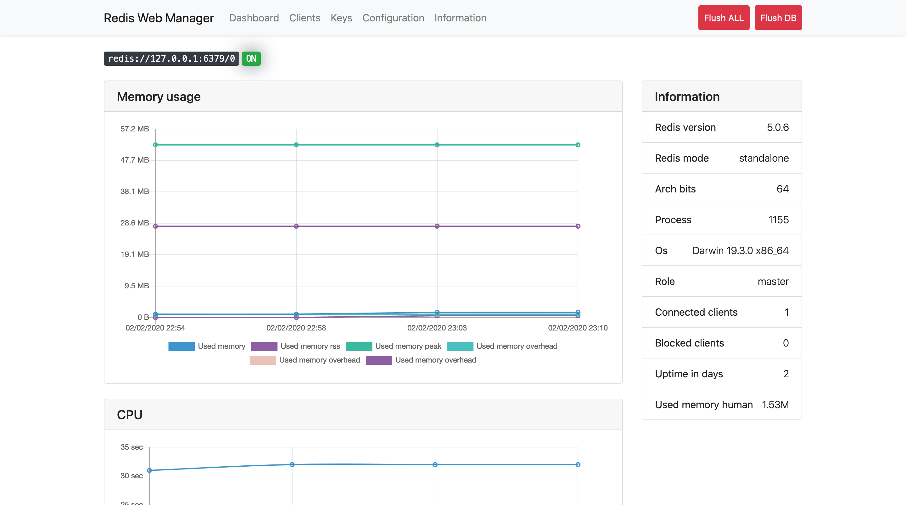
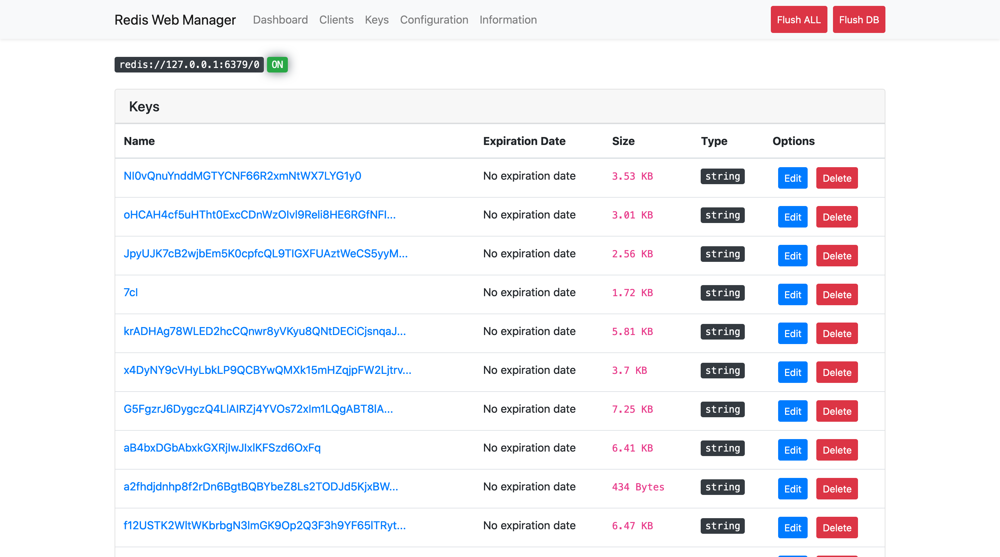
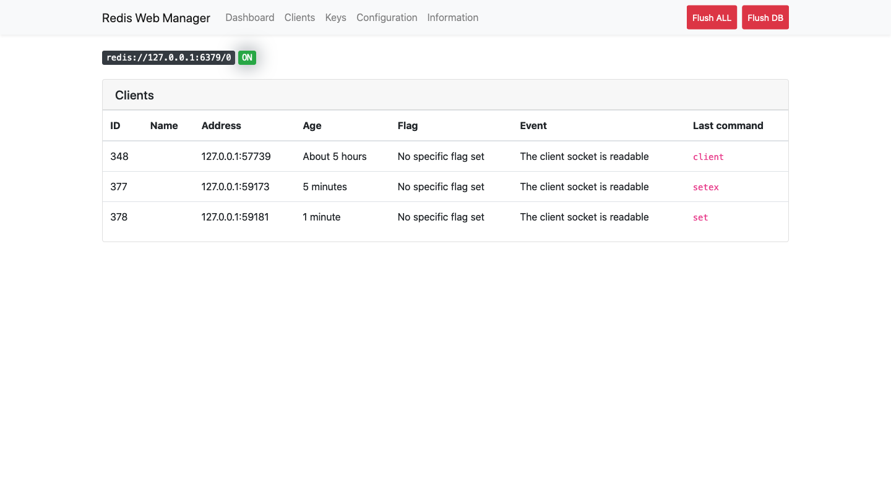

# RedisWebManager

[](https://badge.fury.io/rb/redis_web_manager)
[](https://codeclimate.com/github/OpenGems/redis_web_manager/maintainability)
[](https://travis-ci.org/OpenGems/redis_web_manager)
[](https://hakiri.io/github/OpenGems/redis_web_manager/master)

[](https://coveralls.io/github/OpenGems/redis_web_manager?branch=master)

Web interface that allows you to manage easily your Redis instance (see keys, memory used, connected client, etc...). 

### Check your stats 
The Dashboard allows you to check the Memory usage, CPU and Redis clients.



### Manage your redis keys
You can easily edit and delete any keys stored in your redis database.



### Keep an eye on your redis clients
Check how many clients are connected and their infos.



## Installation
Add this line to your application's Gemfile:

```ruby
gem 'redis_web_manager'
```

And then execute:
```bash
$ bundle
```

Or install it yourself as:
```bash
$ gem install redis_web_manager
```

Add the custom route in your `routes.rb`:
```
mount RedisWebManager::Engine => '/redis_web_manager'
```

Access to RedisWebManager at `/redis_web_manager`

## Configuration

You can configure RedisWebManager: 

```ruby
# initializers/redis_web_manager.rb

RedisWebManager.configure do |config|
  config.redises = {
    default: Redis.new(db: 1),
    production: Redis.new(url: 'XXX')
  } # Default { default: Redis.new } (Hash with instance(s) of Redis)
  config.lifespan = 2.days # Default 15.days (Lifespan of each keys for dashboard)
  config.authenticate = proc {
                           authenticate_or_request_with_http_basic do |username, password|
                              username == 'TEST' && password == 'TEST'
                            end
                          } # Default nil (Authenticate method to secure tools)
end
```

## Collect data for dashboard

In order to have data on your dashboard you must collect the data like this:
```ruby
data = RedisWebManager::Data.new(:default)
data.perform
```

or 

```ruby
RedisWebManager.redises.keys.each do |instance|
  data = RedisWebManager::Data.new(instance)
  data.perform
end
```

If you are using a system to run background tasks in your application (like Sidekiq, Sucker Punch or ActiveJob), you can write your own background task to update the dashboard statistics.

Sidekiq exemple:
```ruby
class DashboardWorker
  include Sidekiq::Worker

  def perform
    data = RedisWebManager::Data.new(:default)
    data.perform
  end
end
```

or

```ruby
class DashboardWorker
  include Sidekiq::Worker

  def perform
    RedisWebManager.redises.keys.each do |instance|
      data = RedisWebManager::Data.new(instance)
      data.perform
    end
  end
end
```

Sucker Punch exemple:
```ruby
class DashboardJob
  include SuckerPunch::Job

  def perform
    data = RedisWebManager::Data.new(:default)
    data.perform
  end
end
```

or

```ruby
class DashboardJob
  include SuckerPunch::Job

  def perform
    RedisWebManager.redises.keys.each do |instance|
      data = RedisWebManager::Data.new(instance)
      data.perform
    end
  end
end
```


## Todo
* [ ] Add graph for most used commands
* [ ] Real time chart update
* [ ] Alert system (ex: triggered when memory is peaking)
* [ ] Command line interface to manage your redis database
* [ ] Logs interface


## Contributing
Bug reports and pull requests are welcome on GitHub at https://github.com/OpenGems/redis_web_manager. This project is intended to be a safe, welcoming space for collaboration, and contributors are expected to adhere to the [Contributor Covenant](http://contributor-covenant.org) code of conduct.

## License

The gem is available as open source under the terms of the [MIT License](https://opensource.org/licenses/MIT).
